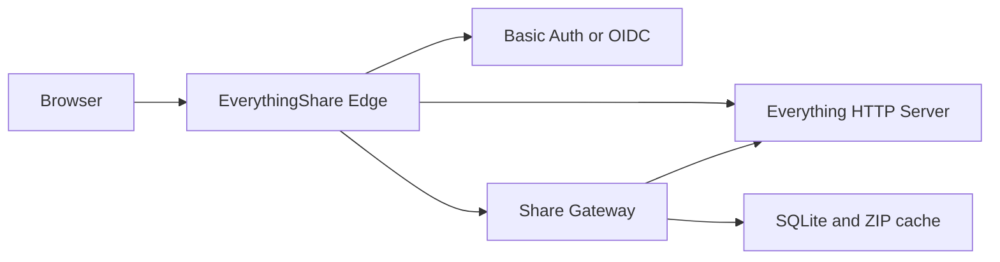

<h1 align="center">EverythingShare</h1>

<p align="center"><strong>Everything版本地百度网盘</strong></p>

<p align="center">
  Turn Everything on Windows into a secure, lightweight, self-hosted file sharing service for home users.
</p>

<p align="center">
  <a href="README.md">简体中文</a> · English
</p>

EverythingShare does not duplicate your files. It reads them through Everything HTTP Server and adds:

- file and folder sharing
- automatic or custom extraction codes
- one-click links containing the extraction code
- expiration dates and download limits
- single-file, large-file, and Range downloads
- folder browsing, streaming ZIP, and controlled ZIP caching
- share management, manifest refresh, code reset, and revocation
- compact desktop and mobile layouts
- a Basic Auth quick start
- generic OIDC login for Logto, Authentik, Keycloak, and other providers

> [!IMPORTANT]
> EverythingShare is an unofficial community project and is not affiliated with or endorsed by voidtools, Everything, Baidu, or Baidu Netdisk. The Chinese slogan describes the intended user experience only. The standard edition requires a separate Everything installation; the one-click demo includes the hash-verified official portable edition under its license.

## Demo


<p align="center">
  
  
</p>

All demo data is fictional. The screenshots contain no real file names, accounts, domains, or server details.

## One-click Windows demo — Everything is included

Download `EverythingShare-Demo-v*-windows-x64.exe` from [Releases](https://github.com/lmy138/EverythingShare/releases) and double-click it:

- the entire distribution is one EXE; Everything, Docker, and a database installation are not required;
- on first launch it extracts the official portable Everything build under `%LOCALAPPDATA%\EverythingShare Demo`, creates fictional sample files, and builds an isolated index;
- the browser opens automatically for search, sharing, code-bearing links, and downloads;
- it binds only to `127.0.0.1` and does not read or modify an existing Everything configuration or index;
- closing the console stops the demo; later launches retain demo shares.

The demo is for local evaluation and must not be exposed directly to the internet. It currently targets Windows x64.

## Single-file Windows standard edition

To connect EverythingShare to your own Everything data without Docker:

1. Download the `windows-amd64` ZIP from [Releases](https://github.com/lmy138/EverythingShare/releases).
2. Extract it and double-click `EverythingShare.exe`.
3. The first-run wizard asks for the Everything HTTP address and credentials.
4. Create an EverythingShare Basic Auth account. The program starts and opens the browser when the wizard finishes.

The program binds to `127.0.0.1:8088` by default and generates random session keys, an internal management key, the SQLite database, and the ZIP cache directory. The Basic Auth password is stored only as a BCrypt hash. The Everything HTTP password remains in the ACL-protected local `everythingshare.json`.

See the [single-file Windows quick start](docs/windows-quickstart.en.md). The Docker deployment below remains the recommended option for public HTTPS, OIDC, and separate protected/public host names.

## Architecture



- `everything.example.com` is the protected Everything search and share-management entry point.
- `share.example.com` is the public extraction-code entry point.
- The original Gateway and Everything ports remain private.

## Requirements

- Windows 10/11 or Windows Server
- Everything 1.4 or 1.5
- no Docker is required for the single-file evaluation edition
- Docker deployment requires Docker Desktop with Linux containers and Windows PowerShell 5.1 or PowerShell 7
- two domain names and an HTTPS reverse proxy for production use

## Ten-minute local quick start

### 1. Configure Everything

Open Everything and:

1. Go to **Tools → Options → HTTP Server**.
2. Enable the HTTP server.
3. Set the port to `8081`.
4. Configure a dedicated HTTP user name and strong password.
5. Allow file downloads.
6. Save the settings.

Never expose Everything port `8081` directly to the public internet.

### 2. Clone the project

```powershell
git clone https://github.com/lmy138/EverythingShare.git
cd EverythingShare
```

### 3. Run guided setup

```powershell
powershell -ExecutionPolicy Bypass -File .\scripts\setup.ps1
```

The script:

1. asks for the Everything HTTP credentials
2. creates an EverythingShare administrator account
3. generates random session and internal proxy keys
4. writes secrets to the Git-ignored `.env` file
5. backs up and installs the Everything web enhancements
6. builds and starts the containers
7. waits for the health check to pass

Default local addresses:

- Search: <http://everything.localhost:8088/>
- Share management: <http://everything.localhost:8088/share-admin/>
- Public share endpoint: <http://share.localhost:8088/>

If your browser does not resolve `.localhost` subdomains automatically, add this to the Windows hosts file:

```text
127.0.0.1 everything.localhost share.localhost
```

### 4. Create your first share

1. Open the search page and sign in.
2. Search for a file or folder.
3. Select the three-dot button on the right.
4. Choose **Create share**.
5. Copy the complete sharing information and send it to the recipient.

The extraction code is carried in the URL fragment:

```text
https://share.example.com/s/random-token#pwd=ABCD
```

URL fragments are not sent to Nginx, the Gateway, or access logs.

## Production deployment

Production deployments must use HTTPS. Keep the bundled Edge bound to:

```text
127.0.0.1:8088
```

Use nginx-ui, Nginx Proxy Manager, Caddy, or another reverse proxy for certificates and public access.

Edit `.env`:

```dotenv
EVERYTHING_HOST=everything.example.com
SHARE_HOST=share.example.com
PUBLIC_BASE_URL=https://share.example.com
COOKIE_SECURE=true
EDGE_BIND=127.0.0.1
EDGE_PORT=8088
```

Reload the stack:

```powershell
docker compose up -d
```

The outer reverse proxy must:

- forward both domains to `127.0.0.1:8088`
- preserve the original `Host`
- send `X-Forwarded-Proto: https`
- allow long-running and Range downloads

See [Reverse proxy configuration](docs/reverse-proxy.md) for a complete Nginx example.

## OIDC login

EverythingShare supports standards-compliant OIDC providers, including:

- Logto
- Authentik
- Keycloak
- Microsoft Entra ID
- other OpenID Connect providers

For a new OIDC installation:

```powershell
powershell -ExecutionPolicy Bypass -File .\scripts\setup.ps1 -AuthMode Oidc
```

Start or update OIDC mode:

```powershell
docker compose -f docker-compose.yml -f docker-compose.oidc.yml up -d --build
```

Register this callback URI:

```text
https://everything.example.com/oauth2/callback
```

See [OIDC setup](docs/oidc.md) for provider examples and troubleshooting.

## Operations

Check status:

```powershell
.\scripts\check.ps1
```

View logs:

```powershell
docker compose logs -f --tail 100
```

Update:

```powershell
git pull
docker compose up -d --build
```

Stop:

```powershell
docker compose down
```

Stopping does not remove the database. Do not run `docker compose down -v` unless you intentionally want to delete the share database and ZIP cache.

## Configuration reference

| Variable | Required | Purpose |
|---|---:|---|
| `EVERYTHING_HOST` | yes | protected search host |
| `SHARE_HOST` | yes | public sharing host |
| `PUBLIC_BASE_URL` | yes | complete public URL used in generated links |
| `EVERYTHING_BASE_URL` | yes | Everything HTTP URL as seen by Docker |
| `EVERYTHING_AUTH_HEADER` | yes | Everything HTTP Basic credentials generated by setup |
| `SESSION_SECRET` | yes | session signing and extraction-code encryption key |
| `ADMIN_SHARED_KEY` | yes | internal Edge-to-Gateway management key |
| `COOKIE_SECURE` | yes | must be `true` behind production HTTPS |
| `EDGE_BIND` | no | defaults to `127.0.0.1` |
| `EDGE_PORT` | no | defaults to `8088` |
| `TRUST_PROXY_HEADERS` | no | keep `true` with the bundled private Edge |
| `ZIP_CACHE_*` | no | ZIP cache size, lifetime, and free-space controls |

Do not lose or casually rotate `SESSION_SECRET`. Existing extraction codes remain verifiable after a rotation, but the management UI can no longer reconstruct one-click links containing old codes.

## Data and backups

Persistent data is stored in the Docker named volume `everythingshare_gateway-data`. Back up:

- `.env`
- `secrets/htpasswd`
- the Gateway SQLite database

Create a timestamped backup:

```powershell
.\scripts\backup.ps1 -DestinationRoot D:\EverythingShare-Backups
```

The backup contains secrets. Keep a second encrypted copy on another disk or host, and never commit it to Git.

## Security design

- Extraction codes are hashed with Argon2id.
- The management copy of each code is encrypted with AES-GCM.
- Share sessions use signed, HttpOnly, SameSite cookies.
- Production cookies use `Secure` and the `__Host-` prefix.
- Failed extraction-code attempts are rate limited by source address.
- Download tickets are random, expiring bearer URLs that support retries and Range requests.
- Nginx logs redact share tokens, download tickets, and public API tokens.
- The Gateway has no host port mapping and is reachable only through the bundled Edge.

Read [SECURITY.md](SECURITY.md) before exposing the service to the internet.

## Known boundaries

- Everything runs on Windows, so source paths currently use Windows drive-letter syntax.
- Folder shares contain a snapshot; refresh the share after the source folder changes.
- A download is counted when a ticket is issued, not when transfer completes.
- Very large folders use streaming ZIP, which cannot resume.
- A single share can contain up to 250,000 manifest entries.

## Development

```powershell
docker run --rm -v "${PWD}:/src" -w /src golang:1.26.5-alpine3.24 sh -c "go test ./... && go vet ./..."
docker build -t everythingshare:test .
```

Project layout:

```text
deploy/          Nginx Basic/OIDC templates
docs/            deployment and authentication documentation
everything-ui/   Everything native-page enhancements
scripts/         Windows setup, installation, backup, and diagnostics
web/             public sharing and management UI
main.go          Gateway service
```

## License

EverythingShare is released under the [MIT License](LICENSE).

See [THIRD_PARTY_NOTICES.md](THIRD_PARTY_NOTICES.md) for dependency and interoperability notices.
