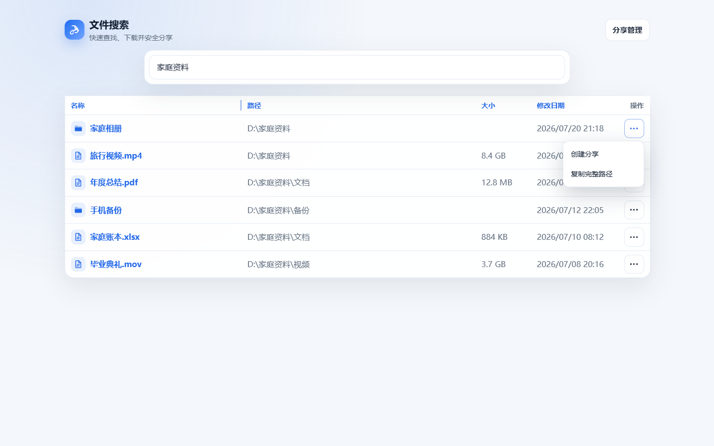
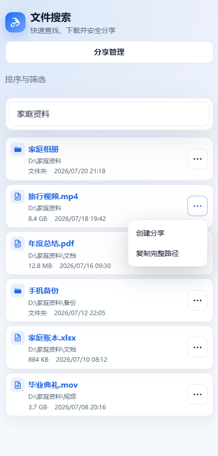
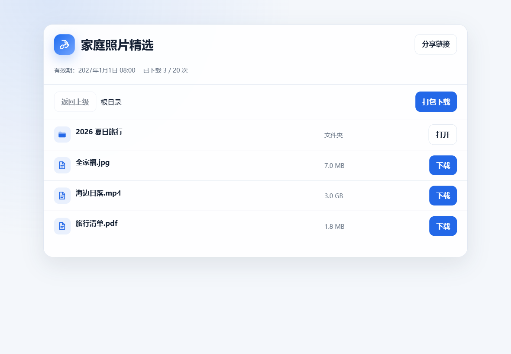
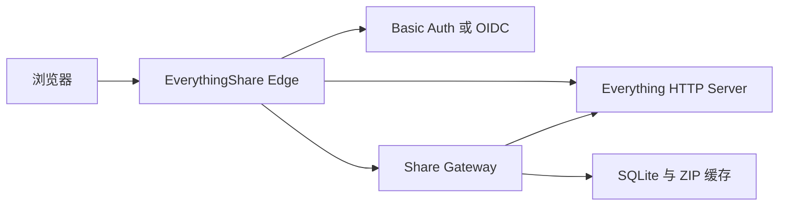

<h1 align="center">EverythingShare</h1>

<p align="center"><strong>Everything版本地百度网盘</strong></p>

<p align="center">
  把 Windows 上的 Everything 变成安全、轻量、适合各中小企业、效率个人、达人家庭用的自托管文件分享服务。
</p>

<p align="center">
  <a href="README.md">English</a> · 简体中文
</p>

EverythingShare 不复制文件。它通过 Everything HTTP Server 读取文件，并提供：

- 文件和文件夹分享
- 文件与文件夹跨页多选和批量分享
- 多来源组合分享及所选项目 ZIP 下载
- 自动或自定义提取码
- 带提取码的一键访问链接
- 在本地生成分享链接二维码
- 到期时间和下载次数限制
- 单文件下载、断点续传和大文件下载
- 文件夹浏览、流式 ZIP 和可控 ZIP 缓存
- 分享管理、刷新目录快照、重置提取码和撤销
- Windows 系统风格文件图标及桌面端、移动端紧凑界面
- Basic Auth 快速部署
- Logto、Authentik、Keycloak 等通用 OIDC 登录

> [!IMPORTANT]
> EverythingShare 是非官方社区项目，与 voidtools、Everything 和百度网盘均无隶属或背书关系。“Everything版本地百度网盘”仅用于直观描述使用体验。标准版不包含 Everything；OneClick 版经哈希校验后内置官方 Everything 便携版及许可证。
## 效果演示



<p align="center">
  
  
</p>


## Windows 下载选择

| 使用场景 | 下载文件 | 是否需要预装 Everything |
|---|---|---|
| 已安装 Everything，只需要增加 EverythingShare | `EverythingShare-v0.4.0-windows-amd64.zip` | 需要，支持 Everything 1.4/1.5 |
| 全新电脑，希望一步完成 Everything 与 EverythingShare | `EverythingShare-OneClick-windows-x64.exe` | 不需要，已内置官方 Everything 1.4.1.1032 x64 便携版 |

### 已经安装 Everything

下载并解压 `EverythingShare-v0.4.0-windows-amd64.zip`，双击 `EverythingShare.exe`。按照原有向导填写现有 Everything HTTP Server 的地址与凭据，再设置 EverythingShare BasicAuth 账号。

### 尚未安装 Everything：OneClick

直接下载并双击 `EverythingShare-OneClick-windows-x64.exe`。向导会配置内置 Everything 搜索和 HTTP Server，让你选择安装独立服务或每次以管理员权限运行，并使用同一组凭据保护 Everything 与 EverythingShare。用户名和密码默认均为 `admin`，也可自行修改。

向导完成后会自动打开 Everything 主界面和 EverythingShare 网页。首次索引通常需要 1～3 分钟；网页暂时没有结果属于正常现象，索引完成后刷新即可。

两种版本均默认只监听 `127.0.0.1:8088`，自动生成随机会话密钥、内部管理密钥、SQLite 数据库和 ZIP 缓存目录。BasicAuth 密码只保存 BCrypt 哈希，Everything HTTP 密码保存在受 ACL 保护的本地 `everythingshare.json` 中。

完整说明见 [Windows 单文件快速入门](docs/windows-quickstart.zh-CN.md)。公网 HTTPS、OIDC 和双域名隔离仍推荐使用后面的 Docker 部署方案。

## 工作方式



- `everything.example.com`：受保护的 Everything 搜索和分享管理入口。
- `share.example.com`：公开分享入口，访问者使用提取码。
- Gateway 和 Everything 原始端口不会直接暴露到公网。

## 环境要求

- Windows 10/11 或 Windows Server
- Everything 1.4 或 1.5
- 单文件体验版无需 Docker
- Docker 部署需要 Docker Desktop（Linux containers）以及 PowerShell 5.1 或 PowerShell 7
- 生产环境需要两个域名和一个支持 HTTPS 的反向代理

## 十分钟本地体验

### 1. 配置 Everything

打开 Everything：

1. 进入“工具 → 选项 → HTTP 服务器”。
2. 启用 HTTP 服务器。
3. 端口填写 `8081`。
4. 设置独立的 HTTP 用户名和强密码。
5. 允许文件下载。
6. 保存设置。

请不要把 Everything 的 `8081` 端口直接开放到公网。

### 2. 下载项目

```powershell
git clone https://github.com/lmy138/EverythingShare.git
cd EverythingShare
```

### 3. 运行引导脚本

```powershell
powershell -ExecutionPolicy Bypass -File .\scripts\setup.ps1
```

脚本会：

1. 询问 Everything HTTP 账号。
2. 创建 EverythingShare 管理账号。
3. 生成随机会话密钥和内部管理密钥。
4. 把敏感配置写入被 Git 忽略的 `.env`。
5. 备份并安装 Everything 网页增强文件。
6. 构建并启动容器。
7. 等待健康检查通过。

默认地址：

- 搜索：<http://everything.localhost:8088/>
- 分享管理：<http://everything.localhost:8088/share-admin/>
- 分享页面：<http://share.localhost:8088/>

如果 `.localhost` 在你的浏览器中不能自动解析，请在 Windows hosts 文件中加入：

```text
127.0.0.1 everything.localhost share.localhost
```

### 4. 创建第一个分享

1. 打开搜索页面并登录。
2. 搜索一个文件或文件夹。
3. 使用行复选框选择一个或多个文件、文件夹；选择可跨结果页保留。
4. 在批量操作栏中选择“分享”。
5. 复制“完整分享信息”发给访问者。

分享链接使用 URL fragment 携带提取码，例如：

```text
https://share.example.com/s/随机标识#pwd=ABCD
```

fragment 不会被发送到 Nginx、Gateway 或访问日志。

## 生产环境部署

生产环境必须使用 HTTPS。推荐做法是继续让 EverythingShare 只监听：

```text
127.0.0.1:8088
```

然后由 nginx-ui、Nginx Proxy Manager、Caddy 或其他反向代理提供证书和公网入口。

编辑 `.env`：

```dotenv
EVERYTHING_HOST=everything.example.com
SHARE_HOST=share.example.com
PUBLIC_BASE_URL=https://share.example.com
COOKIE_SECURE=true
EDGE_BIND=127.0.0.1
EDGE_PORT=8088
```

重新加载：

```powershell
docker compose up -d
```

外层代理必须：

- 把两个域名都转发到 `127.0.0.1:8088`
- 保留原始 `Host`
- 发送 `X-Forwarded-Proto: https`
- 允许长时间下载和 Range 请求

完整示例见 [反向代理配置](docs/reverse-proxy.md)。

## 使用 OIDC 登录

EverythingShare 可连接任何标准 OIDC 身份服务，例如：

- Logto
- Authentik
- Keycloak
- Microsoft Entra ID
- 其他标准 OpenID Connect Provider

全新安装：

```powershell
powershell -ExecutionPolicy Bypass -File .\scripts\setup.ps1 -AuthMode Oidc
```

启动或更新 OIDC 模式：

```powershell
docker compose -f docker-compose.yml -f docker-compose.oidc.yml up -d --build
```

OIDC 回调地址：

```text
https://everything.example.com/oauth2/callback
```

详细步骤见 [OIDC 配置](docs/oidc.md)。

## 常用操作

检查状态：

```powershell
.\scripts\check.ps1
```

查看日志：

```powershell
docker compose logs -f --tail 100
```

更新：

```powershell
git pull
docker compose up -d --build
```

停止：

```powershell
docker compose down
```

停止不会删除数据库。不要运行 `docker compose down -v`，除非你明确希望删除分享数据库和 ZIP 缓存。

## 配置项

| 变量 | 必填 | 用途 |
|---|---:|---|
| `EVERYTHING_HOST` | 是 | 受保护的搜索域名 |
| `SHARE_HOST` | 是 | 公开分享域名 |
| `PUBLIC_BASE_URL` | 是 | 分享链接使用的完整外部地址 |
| `EVERYTHING_BASE_URL` | 是 | 容器访问 Everything HTTP Server 的地址 |
| `EVERYTHING_AUTH_HEADER` | 是 | Everything HTTP Basic 凭据，由脚本生成 |
| `SESSION_SECRET` | 是 | 会话签名和提取码加密密钥 |
| `ADMIN_SHARED_KEY` | 是 | Edge 与 Gateway 之间的内部管理密钥 |
| `COOKIE_SECURE` | 是 | 生产 HTTPS 环境必须为 `true` |
| `EDGE_BIND` | 否 | 默认 `127.0.0.1` |
| `EDGE_PORT` | 否 | 默认 `8088` |
| `TRUST_PROXY_HEADERS` | 否 | 使用内置 Edge 时保持 `true` |
| `ZIP_CACHE_*` | 否 | ZIP 缓存大小、时效和磁盘余量 |

不要修改或丢失 `SESSION_SECRET`。已有分享的提取码副本使用该密钥加密；轮换密钥后，旧提取码仍可验证，但管理页无法再生成包含旧提取码的一键链接。

## 数据与备份

数据保存在 Docker named volume `everythingshare_gateway-data`。至少备份：

- `.env`
- `secrets/htpasswd`
- Gateway SQLite 数据库

`.env` 和 `secrets/htpasswd` 包含敏感信息，绝不能提交到 Git。

创建一份带时间戳的本地备份：

```powershell
.\scripts\backup.ps1 -DestinationRoot D:\EverythingShare-Backups
```

备份目录包含数据库、`.env` 和登录密码文件。请再把它加密复制到另一块磁盘或另一台主机。

## 安全设计

- 提取码使用 Argon2id 保存。
- 管理页中需要显示的提取码副本使用 AES-GCM 加密。
- 分享访问会话使用 HMAC 签名、HttpOnly 和 SameSite Cookie。
- 生产 Cookie 使用 `Secure` 和 `__Host-` 前缀。
- 提取码失败尝试受到按来源地址限制。
- 下载票据是随机、限时的 bearer URL，以支持浏览器重试和 Range 下载。
- Nginx 日志会隐藏分享 token、下载 ticket 和公开 API token。
- Gateway 不直接映射宿主机端口，只能通过内置 Edge 访问。

安全问题请阅读 [SECURITY.md](SECURITY.md)。

## 已知边界

- Everything 只运行在 Windows，因此源文件路径目前只支持 Windows 盘符路径。
- 文件夹分享保存创建时的目录快照；源目录变化后需要在分享管理中刷新。
- 下载次数在生成下载票据时计数，而不是在文件传输结束时计数。
- 超大文件夹会采用流式 ZIP，下载过程中不能断点续传 ZIP。
- 当前单个分享最多记录 250,000 个目录条目。

## 开发

```powershell
docker run --rm -v "${PWD}:/src" -w /src golang:1.26.6-alpine3.24 sh -c "go test ./... && go vet ./..."
docker build -t everythingshare:test .
```

项目结构：

```text
deploy/          Nginx Basic/OIDC 模板
docs/            部署与认证文档
everything-ui/   Everything 原生页面增强
scripts/         Windows 引导、安装和诊断
web/             分享页与管理页
main.go          Gateway 服务
```

## 许可证

EverythingShare 使用 [MIT License](LICENSE)。

第三方组件和许可证见 [THIRD_PARTY_NOTICES.md](THIRD_PARTY_NOTICES.md)。
